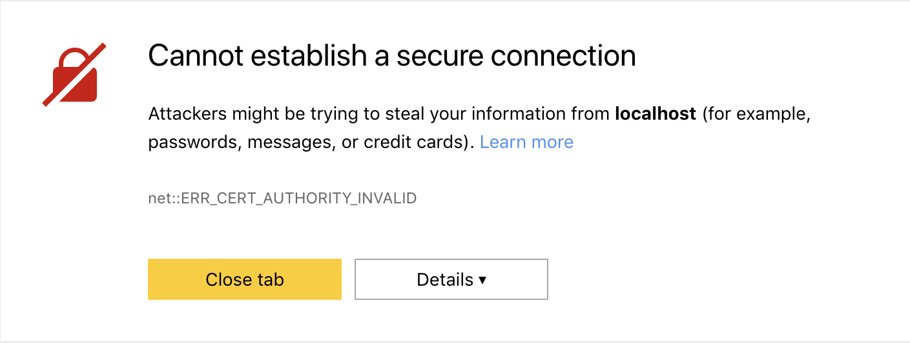
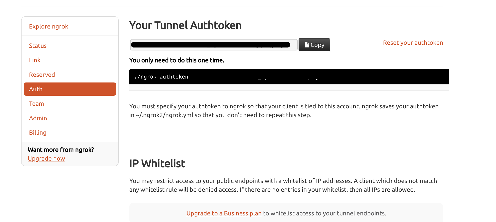

# Пользовательские турбо-компоненты

Репозиторий с кодом пользовательских компонентов, которые могут быть использованы на Турбо-страницах.

## Начало разработки

### Клонирование репозитория

Для начала необходимо сделать форк проекта. Затем можно выполнить команду

```sh
git clone git@github.com:<your-username>/custom-components.git custom-components
cd custom-components
npm i
npm start
```

Где `your-username` — ваш ник на github.

Проверяем работу репозитория: переходим на `https://localhost:8443/render/ext-exchange-rates/default`.

Соглашаемся с недоверенным сертификатом (мы починим это позднее).  Вы должны увидеть кастомный блок `ExtExchangeRates`.

### Решаем проблемы с сертификтом

Несмотря на то, что невалидный сертификат не влияет на работу компонента, он может сильно раздражать, а
`http` хост мы использовать не можем. Давайте починим это:

#### Использование туннелера

Первый и рекомендованный способ — проксировать запрос на `http` хост. В примере мы будем настраивать
`ngrok`, но если он вам почему-то не подходит, существуют альтернативы, например
[`cloudflare argo`](https://www.cloudflare.com/products/argo-tunnel/) или
[go-http-tunnel](https://github.com/mmatczuk/go-http-tunnel).

1. Нужно зарегистрироваться или авторизоваться на https://ngrok.com
2. Получаем и копируем token 
3. Устанавливаем npm-версию клиента [`ngrok`](https://www.npmjs.com/package/ngrok)
4. Сохраняем токен `ngrok authtoken <your-auth-token>`
5. В корне репозитория запускаем `npm start`
6. В отдельном табе консоли выполняем команду `ngrok http 8081` и переходим на `https` версию туннеля.

#### Настройка браузеров

В качестве альтернативы можно настроить бразуер:


Например, `google chrome` или `yandex browser`
позволяют использовать самоподписанный сертификат для `localhost`.
Для этого необходимо открыть в новой вкладке `browser://flags`
(`chrome://flags` для google chrome) и через поиск найти #allow-insecure-localhost и включить его.

Похожую настройку имеет и mozilla firefox: вкладка `about:config` и настройка `network.websocket.allowInsecureFromHTTPS` (**обратите внимание, что он
выключает проверку не только localhost! не забудьте выключить после окончания разработки**).

#### Создание корневого сертификата

Немного более радикальный способ — сгенерировать `rootCa` сертификат с
помощью утилиты: https://github.com/FiloSottile/mkcert. Получившиеся ключи
нужно положить в `/keys`. **Ключи нельзя коммитить, т.к. они дают возможность подменять трафик вашего компьютера**.

## Создание своего компонента
После того, как мы настроили среду, можно приступить к написанию своего компонента.

### Структура директории с блоками

Для его создания необходимо соблюдать соглашение по наименованию:

```
components/
└── ExtFancyButton
    ├── ExtFancyButton.examples
    │   └── default.xml
    ├── ExtFancyButton.scss
    └── ExtFancyButton.tsx
```

То, есть все кастомные блоки лежат в корневой директории `components`.

Отдельный блок имеет свою директорию, начинается с `Ext` и используют `pascal case` для наименования.

> Например, в данном случае:`ExtFancyButton` — директория с блоком.

Компонент называется так же, как и директория.

> Например, в данном случае:`ExtFancyButton.tsx` — файл входа в блок (будет вызван с пришедшими данными на сервере и гидрирован на клиенте).

`<Component-Name>.examples` - директория с примерами данных для отображения блока. Используется для отладки.

> Например, в данном случае:`ExtFancyButton.examples` — директория с примерами к блоку.

Примеры именуются свободно, и имеют расширение `.xml`

> Например, в данном случае: `default.xml` — единственный пример для блока.

### Написание своего примера

Все примеры описываются в xml формате, как содержимое `rss`-файла. Пример:

```xml
<ExtExchangeRates data-rates='["USD","EUR","CHF","GBP","JPY","AUD","CZK"]'/>
```

Данные можно передавать с помощью `data-`аттрибутов, в компонент они придут как пропсы с такими же
названиями, но сериализованные для удобства:

- Если в качестве значения передана строка, которая сериализуется в число (например, `"123"` или `"123.123"`),
то в качестве аргумента в компонент будет передано число
- Если в качестве значения передана строка, которая сериализуется в объект (не примитив), то в качестве
аргумента будет передан объект (например, `'{"a": "b"}'` или `'["USD","EUR"]'`).
- В иных случаях в качестве значения будет передана строка.

### Написание кода

Все блоки пишутся строго на `typescript`. Точка входя для блока должна экспортировать class или простую (не стрелочную) функцию, названные так же, как и компонент.

**Валидные записи**:

```javascript
export class ExtExchangeRates extends React.PureComponent<IProps> {}
```

```javascript
export function ExtExchangeRates () {}
```

**Невалидные записи**:

```javascript
export const ExtExchangeRates = () => {}
```

```javascript
export default function ExtExchangeRates () {}
```

При импорте он будет вызван как реакт-компонент, а в качестве пропсов ему будут переданы данные из rss.
Внутри компонента можно импортировать стили, которые приедут вместе с ним.

### Отладка кода

Код компонента доступен по ссылке `/render/<component-name>/<example-name>`. Список всех примеров можно
посмотреть на заглавной странице.

## Как попасть внутрь репозитория

1. Вы создаете `pull-request` в репозиторий
2. Проходят все линтеры. Если линтеры не проходят, пулреквест не рассматривается. Если есть проблемы, связанные с линтингом файлов (например, конфликтующие линтеры или ошибки во время линтинга кода), необходимо создать issue.
3. После того, как прошли все линтеры, пулреквест получает два апрува от команды.
4. Пулреквест вливается в репозиторий.

## Релизный процесс (когда я окажусь в `production`?):

1. Отведение новой релизной ветки происходит автоматически в пятницу вечером.
2. За выходные все кастомные блоки тестируются.
3. Если все хорошо, то выпускаем новую версию пакета компонентов. Если есть проблемы с отдельными блоками, то версия остается старой.
4. Релиз с компонентами попадают на страницы в понедельник.
5. Как только это происходит, мы призываем авторов новых / обновленных компонентов в пулреквестах и сообщаем о статусе правок.

## Работа с линтерами и CI

Мы используем много самых разнообразных линтеров для контроля качества кода.

- Для контроля стилей (`.scss`) мы используем stylelint.
- Для контроля наименования мы используем [самописный линтер](tools/lint-filesystem.ts)
- Для контроля типо мы испольщуез `tsc`.
- Для контроля качества кода мы используем eslint с рядом плагинов.

Часть из них запускается перед коммитом, часть — перед пушем в удаленный репозиторий.

Все плагины `eslint` без приставки `local` являются глобальными и информацию по ним можно найти в вашей любимой
поисковой машине.
Линтеры с приставкой `local` находятся локально (в директории [`lints/rules`](lints/rules)), и в случае вопросов можно
обращаться к readme. Например, если упало правило `local/correct-file-export`, можно обратится к
[`lints/rules/correct-file-export/Readme.md`](lints/rules/correct-file-export/Readme.md). Аналогично для других линтеров.

Если линтер падает на прекомите, можно сначала попробовать поправить изменения автоматически с помощью команды:
`npm run lint:fix`.

## Вопросы и проблемы

В случае каких-либо проблем или вопросов вы можете создать `issue`.
